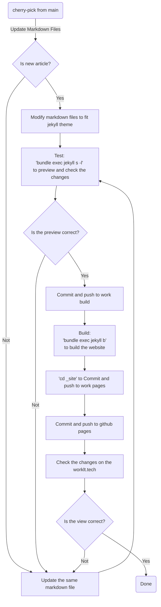

# [worklt.tech](https://worklt.tech/) building...

Merge from [jekyll-theme-chirpy](https://github.com/cotes2020/jekyll-theme-chirpy) -> [demo](https://chirpy.cotes.page/)

## Workflow

```mermaid
---
config:
  maxHeight: 100%
---
flowchart TD
    A(cherry-pick from main) -->|Update Markdown Files| B{Is new article?}
    B -->|Yes| C[Modify markdown files to fit jekyll theme]
    B -->|Not| D[Update the same markdown file]
    C --> E
    D --> E[Test: <br>'bundle exec jekyll s -l' <br>to preview and check the changes]
    E --> F{Is the preview correct?}
    F -->|Yes| G[Commit and push to work build]
    F -->|Not| D
    G --> I[Build: <br>'bundle exec jekyll b' <br>to build the website]
    I --> J['cd _site' to Commit and push to work pages]
    J --> K[Commit and push to github pages]
    K --> L[Check the changes on the worklt.tech]
    L --> M{Is the view correct?}
    M -->|Not| D
    M -->|Yes| N(Done)
```