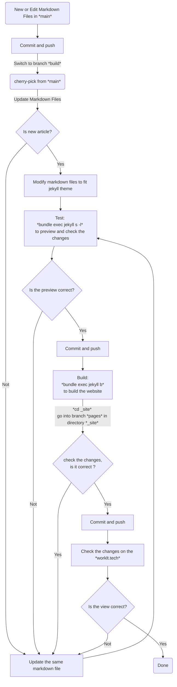

# [worklt.tech](https://worklt.tech/)

Working on Loving Technology...
- AI: Deep learning, Transformer, Stable difffusion, whisper
- Physics: Fluid Dynamics, Biophysics
- ...

## 文件目录
- 代码：[src](src)
- 推文：[_posts](_posts)
- 书籍：[_books](_books)
- 静态文件：[assets](assets) -> 包含图片等二进制文件

## Workflow（Start from branch `main`）
> - branch `main`: New and edit Markdown files content branch.
> - branch `build`: You Jekyll theme or others generattor code branch.
> - branch `pages`: Generated original website results.

