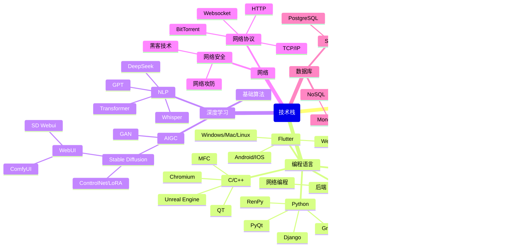

---
# the default layout is 'page'
icon: fas fa-info-circle
order: 4
mermaid: true
---

Work on Lusting Techonology... 
致力于所热爱的技术栈的学习与探索...

> Stay hungry, stay foolish.  
> 坚持学习，坚持前进，扩展技术栈，加深技术理解.
{:.prompt-info}

> 科学技术是第一生产力.  
> Science and technology constitute the primary productive force.
{:.prompt-info}

<address> 
  西湖区, 杭州  
  Xihu District, Hangzhou  
  浙江, 中国  
  Zhejiang Province, China  
  310027
</address>

爱好: 羽毛球，足球，健身，阅读，音乐，动漫，电影... 
Hobbies: Badminton, football, fitness, reading, music, anime, movies...

> 最近更新于(Last updated on): {{ "now" | date: "%a, %b %d, %Y" }}
{:.prompt-tip}
